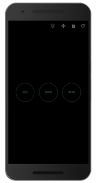
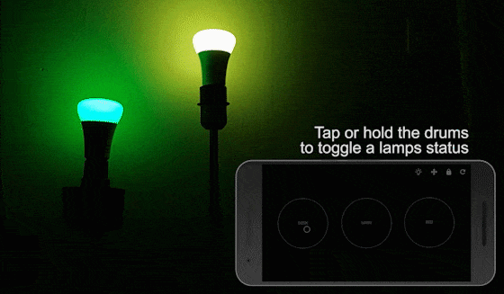

#  Hue Drums
> Play your hue lights like a drum and make your own lightshow!

You can find all releases and release notes here: https://github.com/tuur29/huedrums/releases.

 

- [Youtube functionality demo](https://youtu.be/eokq6eNTzFg)
- [Youtube music demo](https://youtu.be/F2KZp8hP2-o)

## Features

Current Features:
- Turn a lamp on as long as you keep your finger on the drum
- Edit colors and brightness mid-drumming
- Strobe your phone's screen
- Easily add a baseline
- Move and resize your drums
- Short tutorial
- Multitouch support
- ...
